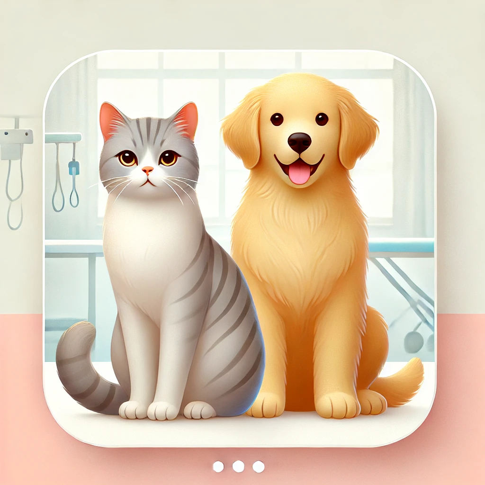
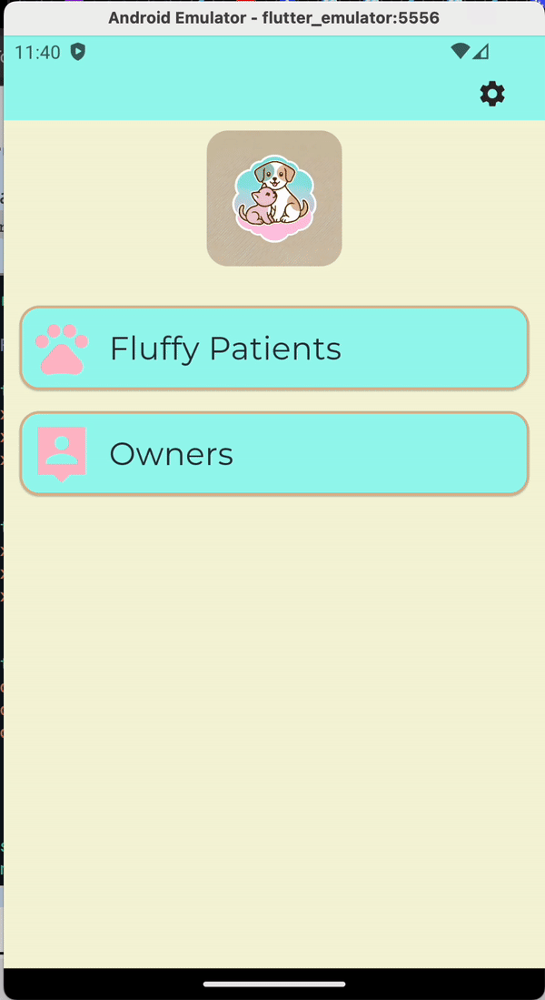

# pet_vet_project

The Veterinary Clinic App is designed for tablets and the web. It’s meant to help veterinarians manage their services, especially for home visits.

## Getting Started

 • Patient Management: Add new patients and edit their details.
 • Visit Management: Schedule new visits, view past visits, and assign treatments.
 • Visit History: View all past visits and see details of specific visits.

### Why I Chose This Project

 • State Management Practice: I want to practice using Bloc/Cubit or Riverpod for managing app state.
 • Firebase Integration: I want to learn how to connect to Firebase and use its data.
 • Clean Architecture: This project will help me practice the clean architecture pattern.
 • Using Multiple Packages: I’ll get experience using various Flutter packages.

#### Project Timeline

##### 29.08.2024

• gAdded logic to toggle between realistic and cute icons, as per the lesson requirements for using the InheritedWidget.

##### 20.08.2024

• Added the settings screen functionality with the ability to change the language using simple setState and didChangeDependencies.

##### 15.08.2024

• For now, Firebase has not been implemented yet, so ‘fake’ data is being used to demonstrate the UI changes. Firebase is planned to be implemented later.

##### 12.08.2024

• Added basic responsive Home screen.
• Added Patients List screen.
• Created PetModel.
• Integrated GoRouter for navigation.
• Integrated Riverpod for state management.
• Integrated EasyLocalization for localization support.
• Added basic styling and TextStyles for consistent UI.

##### 26.07.2024

 • Starter Project Added: Basic app with no features yet.
 • Very basic digram: [Link](https://app.diagrams.net/#G14CaQT5roc3dvEoZBYau0jwQQxhuQzHS9#%7B%22pageId%22%3A%22kXz09J5oTDUhG0XenFSC%22%7D)
  